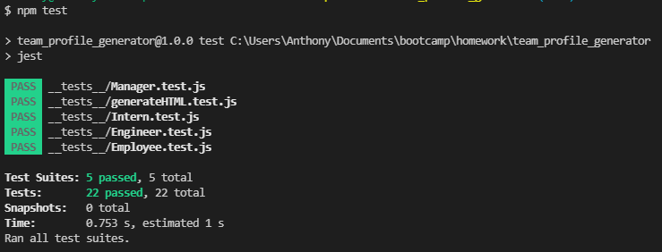
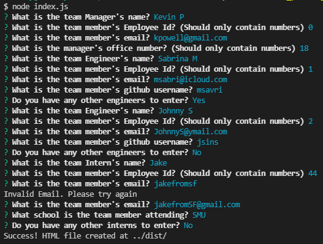

# Team Profile Generator

[](https://opensource.org/licenses/MIT)

## Description
<!-- Here you should enter a little about your project. -->

An application to allow the user to generate a quick team profile page in html. This project utilizes [Inquirer](https://github.com/SBoudrias/Inquirer.js/), [Jest](https://github.com/facebook/jest), as well as my own [README Maker](https://github.com/Vidalatan/readme_maker). The application creates a nice looking team profile page that will display some information based on what the user's inputs. Currently, it asks for employee name, id, email, and depending on their role office number, github username, or attending school. The email populates with a clickable link that will open your default electonic mailing application with the team member's email in the 'To' section. The github username will also populate as a link to that github profile.

This application is primarily meant to be a display of the ability to dynamically generate a nice looking HTML page based on user inputs.
## Table of Contents

1.  [Installation](#installation)

2.  [Usage](#usage)

3.  [License](#license)

4.  [Contributing](#contributing)

5.  [Tests](#tests)

6.  [Questions](#questions)

7.  [Finished Product](#finished-product)

---

## [Installation](#installation)
<!-- Here you should enter how to install your project. You can use the outline below, or create one yourself -->
<!-- If you would like to have images in your instructions, enclose them like so:  -->

<!-- Make sure to have a '>' character before each new line -->
>## Step One
>Clone or Download.
>
>You can clone the repo directly from github here, or you can also download it as a zip file. Just look for the green button at the top right corner of the github repo.

>## Step Two
>Install dependencies.
>
>Once you have the team_profile_generator on your computer, open up a terminal on the location of that folder. Afterwards, enter 'npm install'

>## Step Three
>Verify everything went smoothly
>
>To check everything worked properly, in that same terminal enter 'npm test' and wait for it to finish testing the app. Once you have gotten several green 'pass' tags, you are good to go.

## [Usage](#usage)
<!-- Here you should enter how to use your project. You can use the outline below, or create one yourself -->
<!-- If you would like to have images in your how to, enclose them like so  -->

<!-- Make sure to have a '>' character before each new line -->
>## Step One
>Navigate your terminal
>
>To actually run the app, you first need to make sure you have a terminal open at the location of the team_profile_generator directory.

>## Step Two
>Start the app.
>
>When you are navigated to the right directory, enter 'node index.js' which should begin the application.

>## Step Three
>Follow the prompts.
>
>From here, it's easy and straight forward. Just follow the prompts and answer what they are asking appropriately. After finishing, you should see a 'Success!' message appear. Retrieve your newly generated html page from the 'dist' directory.

---

## [License](#license)
[](https://opensource.org/licenses/MIT)

 Copyright (c) 2022 Vidalatan Licensed under the MIT License license.

---

## [Contributing](#contributing)
<!-- Here you should edit how someone should contribute to your project, or what guidelines to follow -->
<!-- This is a default template that you are welcome to use -->

Thank you for considering contributing to this project!

Following these contributing guidelines helps communicate that you respect the time of those who are managing and developing this open source project.
In return, you should recieve that same respect back in addressing your issue, assessing changes, and helping you finalize your pull requests.

There are many ways to contribute from documentation, tutorials, social media, but reports, feature requests or submitting your own code. Please feel 
encouraged to assist in any way applicable to your skills!


---

## [Tests](#tests)
<!-- Here you should enter how you have tested the project, and possibly any images or videos demonstrating it's use -->
<!-- You can format your images or videos like this:  -->

Tests were created for each of the four classes created. Each test was designed to ensure that the class it was testing for was able to properly instantiate an object with the correct properties.




Here is a video demonstrating the use of the Team Profile Generator


https://user-images.githubusercontent.com/59946423/160685702-6065be62-6506-4714-9613-4a5bb0fdd262.mp4


### Below are the individual tests performed: 

Employee test
```javascript
const { test, expect } = require('@jest/globals');
const Employee = require('../lib/Employee');

const testEmployee = new Employee('John', 1, 'johndoe@email.com')

test('Tests if employee has a name', () => {
    expect(testEmployee.name).toBe('John')
});

test('Tests if employee has an id', () => {
    expect(testEmployee.id).toBe(1)
});

test('Tests if employee has email', () => {
    expect(testEmployee.email).toBe('johndoe@email.com')
})

test('Tests if role is "Employee"', () => {
    expect(testEmployee.getRole()).toBe('Employee')
})
```


Manager test
```javascript
const { test } = require("@jest/globals");
const Manager = require("../lib/Manager");

const testManager = new Manager('Alvin', 2, 'alvina@email.com', 0);

test('Tests if Manager has a name', () => {
    expect(testManager.getName()).toBe('Alvin')
});

test('Tests if Manager has an id', () => {
    expect(testManager.getId()).toBe(2)
});

test('Tests if Manager has email', () => {
    expect(testManager.getEmail()).toBe('alvina@email.com')
})

test('Tests if Manager has office number', () => {
    expect(testManager.getON()).toBe(0)
})

test('Tests if role is "Manager"', () => {
    expect(testManager.getRole()).toBe('Manager')
})
```


Engineer test
```javascript
const { test } = require("@jest/globals");
const Engineer = require("../lib/Engineer");

const testEngineer = new Engineer('Monica', 3, 'monicam@email.com', 'https://github.com/monicam')

test('Tests if Engineer has a name', () => {
    expect(testEngineer.getName()).toBe('Monica')
});

test('Tests if Engineer has an id', () => {
    expect(testEngineer.getId()).toBe(3)
});

test('Tests if Engineer has email', () => {
    expect(testEngineer.getEmail()).toBe('monicam@email.com')
})

test('Tests if Engineer has github', () => {
    expect(testEngineer.getGithub()).toBe('https://github.com/monicam')
})

test('Tests if role is "Engineer"', () => {
    expect(testEngineer.getRole()).toBe('Engineer')
})
```


Intern test
```javascript
const { test } = require("@jest/globals");
const Intern = require("../lib/Intern");

const testIntern = new Intern('Kyle', 4, 'kylek@email.com', 'SMU');

test('Tests if Intern has a name', () => {
    expect(testIntern.getName()).toBe('Kyle')
});

test('Tests if Intern has an id', () => {
    expect(testIntern.getId()).toBe(4)
});

test('Tests if Intern has email', () => {
    expect(testIntern.getEmail()).toBe('kylek@email.com')
})

test('Tests if Intern has school', () => {
    expect(testIntern.getSchool()).toBe('SMU')
})

test('Tests if role is "Intern"', () => {
    expect(testIntern.getRole()).toBe('Intern')
})
```


generate HTML test
```javascript
const { test } = require("@jest/globals");
const Manager = require('../lib/Manager');
const Engineer = require("../lib/Engineer");
const Intern = require("../lib/Intern");
const generateHTML = require('../src/generateHTML')

const testManager = new Manager('John', 0, 'johnj@email.com', 1)
const testEngineer = new Engineer('Avery', 1, 'averya@email.com', 'averya')
const testIntern = new Intern('Jessica', 2, 'jessicaj@email.com', 'SMU')

// put one of each through the generateCard method
generateHTML.generateCards([testManager, testEngineer, testIntern])

const expectedManager = 
`<div class="card shadow mx-3 p-0" style="width: 18rem;">
    <div class="card-body bg-danger">
        <h5 class="card-title">Name: John</h5>
        <h6 class="card-title">☕ Manager</h6>
    </div>
    <ul class="list-group list-group-flush p-3 bg-secondary">
        <li class="list-group-item">ID: 0</li>
        <li class="list-group-item">Email: <a href = "mailto:johnj@email.com">johnj@email.com</a></li>
        <li class="list-group-item">Office Number: 1</li>
    </ul>
</div>
`;

const expectedEngineer = 
`<div class="card shadow mx-3 p-0" style="width: 18rem;">
    <div class="card-body bg-danger">
        <h5 class="card-title">Name: Avery</h5>
        <h6 class="card-title">🔧 Engineer</h6>
    </div>
    <ul class="list-group list-group-flush p-3 bg-secondary">
        <li class="list-group-item">ID: 1</li>
        <li class="list-group-item">Email: <a href = "mailto:averya@email.com">averya@email.com</a></li>
        <li class="list-group-item">Github: <a href="https://github.com/averya">averya</a></li>
    </ul>
</div>
`;

const expectedIntern = 
`<div class="card shadow mx-3 p-0" style="width: 18rem;">
    <div class="card-body bg-danger">
        <h5 class="card-title">Name: Jessica</h5>
        <h6 class="card-title">🏫 Intern</h6>
    </div>
    <ul class="list-group list-group-flush p-3 bg-secondary">
        <li class="list-group-item">ID: 2</li>
        <li class="list-group-item">Email: <a href = "mailto:jessicaj@email.com">jessicaj@email.com</a></li>
        <li class="list-group-item">School: SMU</li>
    </ul>
</div>
`;

test('Test if card is added to the manager class through genHTML function', () => {
    expect(testManager.card).toBe(expectedManager)
})

test('Test if card is added to the engineer class through genHTML function', () => {
    expect(testEngineer.card).toBe(expectedEngineer)
})

test('Test if card is added to the intern class through genHTML function', () => {
    expect(testIntern.card).toBe(expectedIntern)
})
```

---

## [Questions](#questions)

 Questions regarding this project should be directed towards @Vidalatan at Vidalatan@gmail.com

## [Finished Product](#finished_product)



Link to [Code Repository](https://github.com/vidalatan/team_profile_generator)

